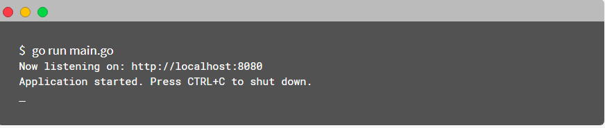

# Overview

Below you'll see an example, doesn't cover all the features of course but it's a good piece 
to see if you like to proceed to the next sections of this book.


Assuming that you have already installed Google Go. If not please follow [installation](https://golang.org/doc/install) guide.

```sh
go get -u github.com/kataras/iris/...
```

```go
package main

import (
    "github.com/kataras/iris"

    "github.com/kataras/iris/middleware/logger"
    "github.com/kataras/iris/middleware/recover"
)

func main() {
    app := iris.New()
    app.Use(recover.New())
    app.Use(logger.New())

    // Method:   GET
    // Resource: http://localhost:8080
    app.Handle("GET", "/", func(ctx iris.Context) {
        ctx.HTML("<h1>Welcome</h1>")
    })

    // same as app.Handle("GET", "/ping", [...])
    // Method:   GET
    // Resource: http://context:8080/ping
    app.Get("/ping", func(ctx iris.Context) {
        ctx.WriteString("pong")
    })

    // Method:   GET
    // Resource: http://localhost:8080/hello
    app.Get("/hello", func(ctx iris.Context) {
        ctx.JSON(iris.Map{"message": "Hello Iris!"})
    })

    // http://localhost:8080
    // http://localhost:8080/ping
    // http://localhost:8080/hello
    app.Run(iris.Addr(":8080"))
}
```

Save above code with `main.go` (its up to you) and run following command to start server




Let's do the same, this time with the [MVC Architectural Pattern](https://en.wikipedia.org/wiki/Model%E2%80%93view%E2%80%93controller).

```go
package main

import (
    "github.com/kataras/iris"

    "github.com/kataras/iris/middleware/logger"
    "github.com/kataras/iris/middleware/recover"
)

func main() {
    app := iris.New()
    app.Use(recover.New())
    app.Use(logger.New())

    app.Controller("/", new(ExampleController))

    // http://localhost:8080
    // http://localhost:8080/ping
    // http://localhost:8080/hello
    app.Run(iris.Addr(":8080"))
}

// ExampleController serves the "/", "/ping" and "/hello".
type ExampleController struct {
    iris.Controller
}

// Get serves
// Method:   GET
// Resource: http://localhost:8080
func (c *ExampleController) Get() {
    c.Ctx.HTML("<h1>Welcome</h1>")
}

// GetPing serves
// Method:   GET
// Resource: http://localhost:8080/ping
func (c *ExampleController) GetPing() {
    c.Ctx.WriteString("pong")
}

// GetHello serves
// Method:   GET
// Resource: http://localhost:8080/hello
func (c *ExampleController) GetHello() {
    c.Ctx.JSON(iris.Map{"message": "Hello Iris!"})
}
```

> Learn more about [Iris MVC](mvc.md)